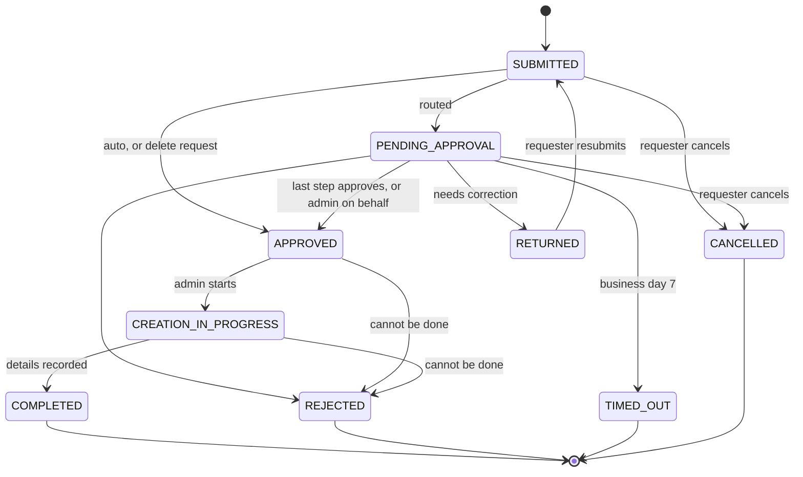
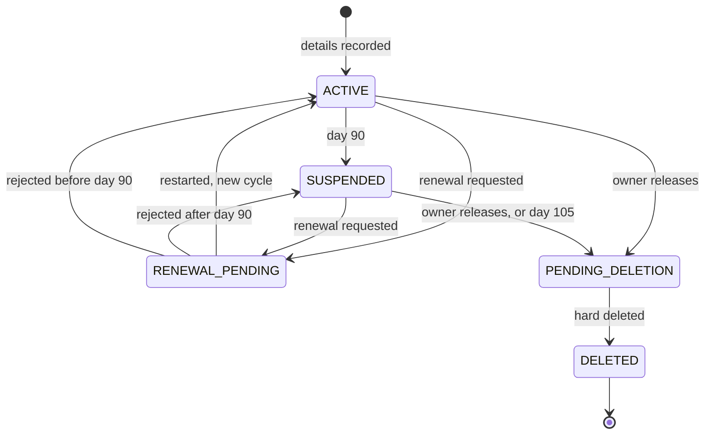

# VM Portal — Locked Plan v2

As of 2026-10-08 · Priyodip

Phase 1 replaces Outlook VM requests with a portal: login, a request form, approval routing, an urgent path to the vCloud team, an admin queue and My VMs. Phase 2 adds the 90-day restart cycle with notices, renewals and hard deletion. Phase 3 adds reporting, and Phase 4 adds read-only vCloud data once the vCloud team grants access.

This plan explains the decisions. `docs/domain.md` is the precise rule set the code follows; if the two ever differ, update this plan. Unanswered questions are in `docs/open-questions.md`, each with the default we build with.

## What changed in v2

- The lifecycle runs on the **mandatory 90-day restart cycle**, not a lease. The long-term expiry is recorded but not enforced.
- After the grace period a VM is **hard deleted**, with no archive.
- VMs live in **vApps**. One request can ask for **several VMs**.
- The form follows the current request email (BU lead, product stack, number of VMs, CPU, RAM, storage), plus agreed additions. There is no VM name field.
- The vCloud team sends **access details** (IP, username, password), with OS defaults and an optional custom username and password.
- **Urgent follow-up**: a requester whose manager is unavailable can go straight to the vCloud team.
- **Support tickets** for snapshot reverts.
- **Assign to me** on every admin queue item.
- **Managers cannot release, delete or hand over a report's VM.**
- Creation failures are rare, so a rejection with a comment is enough. The on-hold flag and failure categories are removed.

## How the vCloud team works

- All VM work is manual in the vCloud dashboard: create, restart, revert, delete. The portal records it and never touches vCloud.
- A vApp is a container for one or more VMs.
- Every VM must be restarted every 90 days, and each restart starts a new cycle.
- Creation almost never fails. Storage depletion is the one known case.
- VM names are the vCloud admins' business. The portal identifies VMs by IP address and owner.

## Locked decisions

| Area | Decision | Why |
| --- | --- | --- |
| Frontend + API | Next.js 16 App Router (TSX), server actions, Tailwind + shadcn/ui | One codebase, one deploy |
| Client state | Zustand: one store factory per feature, provider on the route that needs it, never holds server data | Official Next.js pattern; no leaks, no stale copies |
| Next.js caching | Cache Components off; every page rendered per request | Every page is per-user |
| Database | PostgreSQL 17 + Drizzle ORM 0.45 | Relational data with strict state transitions |
| Auth | Better Auth: email + password, verification, DB sessions, admin plugin | No SSO; self-hosted |
| Scheduler | One daily job in a worker container (Phase 2) | Idempotent; no per-VM timers |
| Notifications | Email through the internal SMTP relay, plus an in-app inbox | People live in Outlook |
| Environments | Local (hot reload in Docker), smoke (production build, local settings), dev and prod servers (same files, own `.env.deploy`) | What runs on a server has run on a laptop |
| Approval routing | One routing function; owner BU and `external_bu_mode` in settings | Small matrix; the open question becomes a setting |
| Approver source | Always from the requester's profile, never typed into the form | Typed emails get misrouted or gamed |
| Lifecycle anchor | 90-day cycle from creation or last restart | How vCloud actually works |
| Notices | 10, 3 and 1 day before suspension; grace notices 5 and 10 days after; final notice and automatic deletion request at 15 | Original spec, applied to the real cycle |
| Renewal | Approved like a new request; the admin restarts the VM; a new cycle starts from the restart date | Original "extend" flow, mapped to restarts |
| Deletion | Hard delete, no archive; owner told before and after | Company practice |
| Requests | One request can ask for 1 to 10 VMs with the same configuration | Matches the current form |
| Credentials | Stored encrypted; shown behind login with an audited reveal; never emailed | A shared default password must not travel in email |
| Urgent follow-up | Requester can escalate a pending request to the vCloud team; an admin verifies, then approves on the manager's behalf or declines | Manager unavailable, VM needed now |
| Admin queue | One queue for creations, handovers, renewals, deletions, follow-ups and tickets; every item has an assignee | Admins see who is handling what |
| Manager limits | Managers can see their team's VMs but cannot release, delete or hand them over | Company rule |
| Email action links | Deep links behind login, never one-click tokens | A forwarded email can't act |

## Roles and permissions

| Action | End user | Manager | Owner-BU manager | vCloud admin |
| --- | --- | --- | --- | --- |
| Request VMs for self | Yes | Yes | Yes | Yes |
| Request VMs for a team member | No | Own reports | Own reports | No |
| See VMs | Own + where backup owner | Own + team (read-only) | All | All |
| Approve / reject / return | No | Own reports | External-BU + fallback | On the manager's behalf after an urgent follow-up, reason required |
| Urgent follow-up | Own pending requests | Own pending requests | Own pending requests | — |
| Renew a VM | Owner, backup owner | Own VMs only | Own VMs only | Any, reason required |
| Release (delete) a VM | Owner only | Own VMs only | Own VMs only | Any, reason required |
| Snapshot-revert ticket | Owner, backup owner | Own VMs only | Own VMs only | Any |
| Mark available for reuse | Owner only | Own VMs only | Own VMs only | Any |
| Work the admin queue | No | No | No | Yes |
| See VM credentials | Owner, backup owner | Own VMs only | Own VMs only | All |
| Confirm new team members | No | Own reports | Own reports | Any |
| Manage users, roles, BUs, settings | No | No | No | Yes |

## Request form

The form keeps every field from today's request email and adds the agreed fields. Filled in automatically: requester name, employee ID, email, manager name, BU, BU lead, request date.

| Field | Input | Source |
| --- | --- | --- |
| On behalf of | Employee picker, managers only | New |
| Reason | Text, required | Current email |
| Project name | Text, required | Whiteboard |
| Purpose | Hosting, Testing, Training, Development, Other | Whiteboard |
| Customer or internal | Radio; customer name if customer | Current email |
| Product stack | Text (Q13) | Current email |
| Duration of VM | Dropdown (Q8); recorded, not enforced (Q35) | Current email |
| Number of VMs | 1 to 10, same configuration for all (Q9, Q14) | Current email |
| Add to an existing vApp | Optional picker of the requester's vApps | New |
| OS and version | Dropdown (Q2) | Current email |
| CPU, RAM, storage | Numbers per VM, within limits (Q2) | Current email |
| Environment | Dev, Test, UAT, Prod | Whiteboard |
| Needed by | Date, optional | Whiteboard |
| Cost center | Text, optional (Q17) | Whiteboard |
| Who needs access | Portal users | Whiteboard |
| Backup owner | User picker, required | Whiteboard |
| Public IP, internet access | Yes/No; a yes is flagged for vCloud review | Whiteboard |
| Custom credentials | Optional username and password | New |

## Manager approval

The manager sees the full request read-only and the VMs the requester already holds. Decisions: Approve, Approve with existing VM (single-VM requests only), Reject, Return for correction. The manager can't edit the specs; to change anything, they return the request.

| Field | Rule |
| --- | --- |
| Comment | Required for Reject and Return |
| Valid business need, size justified | Two checkboxes, both required to approve |
| Category | Required for Reject and Return (lists below) |
| Fields to update | Required for Return; highlighted for the requester |
| Resubmit-by date | Optional for Return; Phase 2 cancels the request after it (Q34) |

| Reject | Return for correction |
| --- | --- |
| Business justification insufficient | Business justification incomplete |
| Existing VM already available | Project details missing |
| Resource request too large | VM configuration incorrect |
| Budget constraints | Security information missing |
| Security or compliance concern | Cost center missing (Q17) |
| Project not approved | Access requirements unclear |
| Incorrect information submitted | Resource size needs revision |
| Other | Other |

The rejection email carries the request ID, employee ID and email, project, approver name and email, decision, category, comments, date and the next step. Every value comes from existing records.

## When the manager is unavailable

- **Urgent follow-up (Phase 1):** on a pending request, the requester picks a priority (High or Urgent) and writes a comment. The request appears in the vCloud queue as "Escalated". An admin verifies it, for example by contacting the manager or BU lead. They then either approve on the manager's behalf (reason required, manager notified) or decline (the request stays with the manager).
- **Delegation (Phase 2):** a manager on leave names a delegate for set dates.
- **Fallback:** if there's no manager on record, the manager is deactivated, or the manager is the requester, the request goes to the owner-BU group, and to a vCloud admin if that group is empty.
- **SLA ladder (Phase 2):** a reminder on business day 2, escalation on day 4, and a time-out on day 7.
- **Admin reassign (Phase 1):** an admin can move any stuck approval, with a reason.

External-BU requests either need the owner-BU manager group's approval or only notify them. That's open (Q3), so it's built as a setting, `external_bu_mode`, with Approve as the default.

## Admin queue

- One queue holds creations, handovers, renewals, deletions, escalated follow-ups and support tickets, with Unassigned, Mine and All tabs.
- **Assign to me** claims an item, and the other admins see "Handled by <name>". Acting on an unassigned item claims it automatically. Taking over someone else's item asks for confirmation and notifies them.
- **Creating VMs:**
  1. Mark the request started.
  2. Create the VMs in the dashboard.
  3. Complete the request with, per VM: vApp, IP, OS, specs as built, creation date, username and password. Hostname and vCloud reference are optional.
  4. If only some VMs could be created, record those and explain why. If none could, reject with a comment.
- **Credentials:** the username is prefilled by OS (Windows: Administrator, Linux: root), and the password with the default VM password. The requester's custom values replace them. The "VM ready" email sends the IP and username plus a link; the password is revealed on the VM page.

## 90-day cycle, renewal and deletion (Phase 2)

S is the suspension date: the cycle start (creation or last restart) plus 90 days.

| Day | What happens |
| --- | --- |
| S-10, S-3, S-1 | Owner and backup owner asked to renew or release |
| S | VM suspended by vCloud (Q28); status Suspended |
| S+5, S+10 | Grace notices, manager copied |
| S+15 | Final notice "permanently deleted, no archive"; deletion request created automatically |
| After deletion | Owner, backup owner and manager notified |

- **Renew:** approved like a new request (Q29). The admin restarts the VM and records the date, and a new cycle starts. Notices pause while the renewal is pending. A rejected renewal resumes the schedule, but deletion never happens sooner than 5 days after the rejection.
- **Release:** the owner types the IP to confirm permanent deletion, and a deletion request goes to the queue with an ETA (Q33). No approval is needed.

## Support tickets

Snapshot revert is the first ticket type. The owner or backup owner picks the VM, names the snapshot (or "latest"), sets a priority, writes a comment and confirms that later changes will be lost. The ticket goes straight to the admin queue with no approval. The admin reverts the VM in the dashboard and resolves the ticket with a comment. Statuses: Open, In progress, Resolved, Rejected, Cancelled.

## Reusing a VM

- Only the owner can mark a VM "available for reuse". A manager can't hand over a report's VM.
- On single-VM requests, the approver sees similar candidates: VMs marked available for reuse in their scope, plus their own VMs. Similar means the same environment and OS, with each spec between 1x and 2x the request (Q18).
- **Approve with existing VM:**
  1. The request goes to the queue as a handover.
  2. The admin resets access (Q19) and records new credentials.
  3. The requester becomes the owner, and a new cycle starts.
  4. The previous owner is notified.

## User creation

| ID | Use case | Actor | Result |
| --- | --- | --- | --- |
| UC-1 | Bootstrap the first admin | Deployer (seed script) | One active vCloud admin |
| UC-2 | Seed the org: BUs, owner BU, BU leads, managers by CSV | vCloud admin | Managers INVITED |
| UC-3 | Accept an invite: set password (link valid 72h) | Invited user | ACTIVE |
| UC-4 | Self-register: name, company email, employee ID, password, BU, manager | Employee | PENDING_ACTIVATION after email verification |
| UC-5 | Confirm a team member, or "not my report" | Selected manager | ACTIVE, or admin queue |
| UC-6 | Work the activation queue | vCloud admin | ACTIVE |
| UC-7 | Create a single user, or import existing VM owners | vCloud admin | INVITED |
| UC-8 | Sign in | Any user | Routed by status, then role |
| UC-9 | Reset a forgotten password | Any user | Other sessions revoked |
| UC-10 | Change a user's role | vCloud admin | Last admin can't be demoted |
| UC-11 | Change a user's manager or BU | vCloud admin | Pending approvals re-routed |
| UC-12 | Deactivate a user: VMs and vApps transferred first | vCloud admin | DEACTIVATED, sessions revoked |
| UC-13 | Reactivate a returning employee | vCloud admin | ACTIVE |
| UC-14 | Set an out-of-office delegate (Phase 2) | Manager | Approvals routed to the delegate |

Everyone starts as an end user, and only admins promote. The manager picker shows only managers in the chosen BU; "My manager isn't listed" goes to the admin queue. A self-registration not verified within 7 days is deleted. Flow: `docs/diagrams/3-user-setup-auth.mmd`.

## Statuses

Requests (create, renew and delete share one table):

VMs:

Support tickets: Open → In progress → Resolved; Open or In progress → Rejected; Open → Cancelled.

## Data model

| Table | Purpose | Key columns |
| --- | --- | --- |
| user | Better Auth user, extended | emp_id, bu_id, manager_id, role, status |
| session, account, verification | Better Auth internals | Generated |
| business_units | BUs | name, is_owner_bu, lead_user_id |
| delegations | Out-of-office (Phase 2) | manager_id, delegate_id, starts_on, ends_on |
| requests | Create, renew, delete | type, status, fulfilment, requester, vm_count, target vApp, form fields, custom credentials (encrypted), assignee, escalation fields |
| approvals | One row per step | approver, routed_via, decision, category, comment, fields_to_update, resubmit_by, offered_vm_id |
| vapps | vApp containers | name, vcloud_ref, owner_id, bu_id |
| vms | Inventory | vapp_id, owner, backup owner, ip, os, specs, username, password (encrypted), cycle_started_on, suspends_on, status, available_for_reuse |
| tickets | Support tickets | type, vm_id, snapshot_ref, priority, status, assignee, resolution |
| notifications | Sent notices, duplicate guard | unique (vm_id, cycle_no, stage) |
| audit_log | Every state change | actor, entity, from/to state, reason |
| settings | Every tunable value | key, value |
| daily_snapshots | Trend data (Phase 2) | day, bu_id, counts |

## Naming conventions

| Where | Convention | Example |
| --- | --- | --- |
| Variables, functions, object keys, API JSON | camelCase | `suspendsOn` |
| Components, types, component files | PascalCase | `RequestForm.tsx` |
| Other files and folders, URLs | kebab-case | `/vm-requests` |
| Postgres tables and columns | snake_case | `suspends_on` |
| Status values, constants, env vars | SCREAMING_SNAKE | `PENDING_APPROVAL` |

## Risks

- **Every VM shares one default password.** Anyone who learns `Password@1234` can log into any VM that still uses it. The portal limits the damage: the password is never emailed, it's shown only behind login with an audited reveal, and it's stored encrypted. The real fix sits with the vCloud team. Users should change it at first login, or each VM should get its own password; the completion form makes a per-VM password as easy to enter as the default.
- **Renewal approvals every 90 days** mean every VM needs a manager decision four times a year. If that's too heavy, Q29 can make renewals automatic for VMs with no open issues.
- **No SSO means no automatic offboarding.** When people leave, their VMs become orphans. Mitigations: the backup owner and the deactivation flow, plus roster confirmation and an inactive-owner flag in Phase 3.
- **The portal can't verify manual work** until Phase 4. It records an admin's word that a VM was created, restarted or deleted.
- **The owner-BU group is a bottleneck** for external-BU requests and fallbacks. Mitigations: at least 2 people, the urgent follow-up, and the SLA ladder.

## Phases

| Phase | Scope | Gate to the next phase |
| --- | --- | --- |
| 1. Replace Outlook requests | Auth and user setup; request form (several VMs, vApp, credentials); approval routing with categories, `external_bu_mode`, urgent follow-up and reuse; admin queue with assign and take-over; completion with per-VM details and credentials; VMs and vApps with search; snapshot-revert tickets; emails; audit; CSV import of existing VMs and vApps | Outlook VM requests switched off |
| 2. 90-day cycle engine | Daily job; notices; suspension; grace; automatic deletion requests; renew and release; SLA ladder; delegation; auto-cancel of returned requests; daily snapshots | Every VM's restart date tracked; no VM deleted without warnings |
| 3. Reporting and quality of life | Role dashboards, exports, roster confirmation, inactive-owner flag, bulk actions, admin 2FA, more ticket types | vCloud team grants API access |
| 4. vCloud read-only data | Sync of status, real suspension dates, usage and idle detection. Creating, restarting and deleting stay manual | — |

Deferred: enforcing the long-term expiry ("Duration of VM", Q35).

Phase 1 build checklist:

- [ ] Better Auth + Drizzle: email and password, verification, reset, DB sessions, rate limiting
- [ ] Status and role checks on every route and server action
- [ ] Seed script, BU admin screen (owner BU, BU lead), CSV import of managers (UC-1 to UC-3)
- [ ] Self-registration with manager confirmation and the activation queue (UC-4 to UC-6)
- [ ] User admin: invite, role, manager or BU change, deactivate with VM and vApp transfer, reactivate (UC-7, UC-10 to UC-13)
- [ ] Request form: current email fields + agreed fields, several VMs, vApp target, custom credentials
- [ ] Approval routing function with `external_bu_mode`; approval screen with categories, fields to update and the reuse panel; approve with existing VM; admin reassign
- [ ] Urgent follow-up: requester escalation; admin approve on behalf or decline
- [ ] Admin queue: one list, assign to me, take over; start, reject with comment, complete with per-VM details, complete handover
- [ ] Credential encryption, OS default usernames, default password setting, audited reveal
- [ ] VMs and vApps pages with search by IP, owner name, employee ID, email; mark available for reuse
- [ ] Snapshot-revert tickets: raise, cancel, start, resolve, reject
- [ ] Template emails on every status change, plus an in-app inbox
- [ ] One state-transition function that writes the audit log
- [ ] CSV import of existing VMs and vApps (with last restart date); unknown owners become INVITED users
- [ ] Docker Compose deploy, SMTP relay, nightly backup with a tested restore
